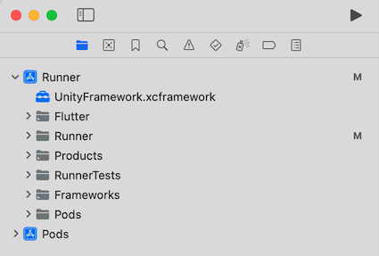
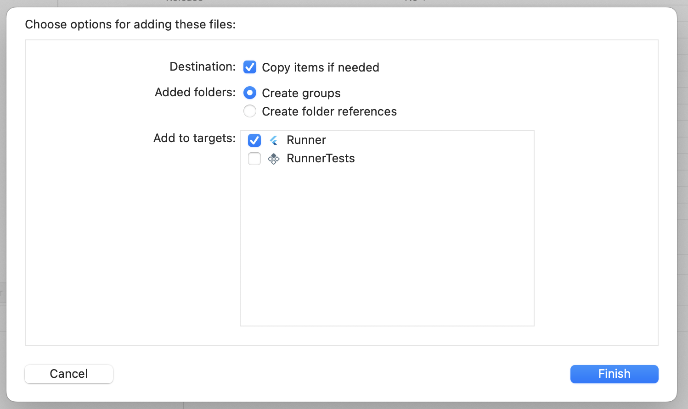
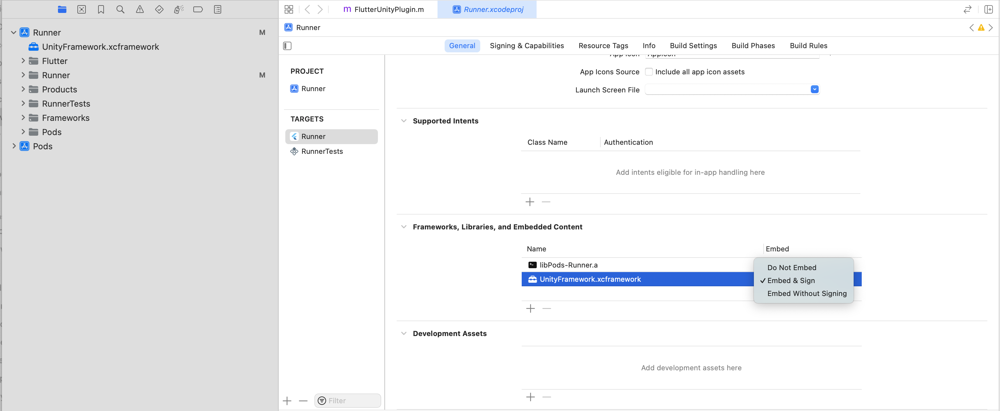

# Situm Flutter AR

> [!NOTE]  
> This plugin is a work in progress.

<p align="center"> 
<h1 align="center">@situm/flutter-ar</h1>
</p>

<p align="center" style="text-align:center">

Bring AR to [Situm Wayfinding](https://situm.com/wayfinding).

</p>

<div align="center" style="text-align:center">

[](https://opensource.org/licenses/MIT)
[](https://pub.dev/packages/situm_flutter)
[](https://flutter.dev/)

</div>

## Getting Started

By following this guide, you'll be able to integrate Situm AR plugin into your own application. Situm AR plugin is composed by:

1. Flutter Code: available in this repo.
2. AR binaries: available upon request through support@situm.com. You'll need them to compile. We have 2 AR binaries:
   1. Android. We'll deliver a folder called **unityExport**
   2. iOS. We'll deliver a **UnityFramework.xcframework**.

Additionally, we've created an [example app](./example) in case you want to take a look at a full application using both Situm SDK and Situm AR app.

### Common setup:

#### Setup Situm SDK Flutter plugin:

First of all, you'll need a Situm account and a venue configured with Situm positioning & maps. To do this, follow [this guide](https://situm.com/docs/first-steps-for-wayfinding/).

First, you'll need to setup Situm SDK Flutter plugin following the instructions contained on the following [link](https://github.com/situmtech/flutter?tab=readme-ov-file#set-up-your-situm-credentials).

#### Install Situm AR Flutter plugin

Then, you may install [situm_flutter_ar](https://pub.dev/packages/situm_flutter_ar) plugin:

```shell
flutter pub add situm_flutter_ar
```

### iOS specific steps:

1. Import the **UnityFramework.xcframework** into your **Runner** project in **XCode**.

   

2. During the impoort, make sure you select the following options:

- Check "Copy items if needed".
- Select "Create groups" for "Added folders".
- Add to target "Runner".

  

3. In the main Target of your app, under General > "Frameworks, Libraries and Embedded Content",
   select "Embed & Sign" for the **UnityFramework.xcframework**.

   

4. Under `<your_flutter_project>/ios`, run:
   ```shell
   pod install
   ```

After this, you may compile & run your application:

```shell
flutter run
```

#### Android setup:

1. Copy the AR binaries (**unityExport** folder in Android) into the **android** folder of your Flutter project.
2. Add the following snippet to the end of the `<your_flutter_project>/android/settings.gradle` file (surely you have similar includes in there!):
   ```shell
   include ':unityExport'
   include ':unityExport:xrmanifest.androidlib'
   ```
3. Complete your `<your_flutter_project>/android/build.gradle` using the following indications:
   ```groovy
   //...
   allprojects {
     repositories {
       // You may already have these three ones:
       google()
       mavenCentral()
       maven { url "https://repo.situm.es/artifactory/libs-release-local" }
       // Add this:
       flatDir {
         dirs "${project(':unityExport').projectDir}/libs"
       }
     }
   ```
4. Add the following permission to the `<your_flutter_project>/android/app/src/main/AndroidManifest.xml` file:
   ```shell
   <uses-permission android:name="android.permission.WAKE_LOCK"/>
   ```
5. Add this line to your `gradle.properties` file:
   ```properties
    unityStreamingAssets=.unity3d, google-services-desktop.json, google-services.json, GoogleService-Info.plist
   ```

After this, you may compile your application:

```shell
flutter run
```

> [!NOTE]  
> We have disabled the AR functionality in Android due to bad performance in low end devices. You'll still need to compile for Android, but you'll not be able to see it working. We'll fix this in a latter version.

### Integrate the ARWidget in your app:

We assume that you already have an application that uses Situm SDK. You may build one by following our [Quickstart Guide for Flutter](https://situm.com/docs/05-a-basic-flutter-app/).

The [example app of this repository](./example/lib/main.dart) contains a complete example on how to integrate the AR plugin. Nonetheless the main steps are described below.

First of all, you'll need to wrap your **MapView** widget inside the **ARWidget**. This way, the user will be presented with the **MapView**, and upon clicking on an "AR button" (only visible on dynamic navigation), the **ARWidget** will appear on the screen.

```dart
  @override
  Widget build(BuildContext context) {
    return Scaffold(
      body: ARWidget(
        buildingIdentifier: buildingIdentifier,
        onCreated: onUnityViewCreated,
        onPopulated: onUnityViewPopulated,
        onDisposed: onUnityViewDisposed,
        arHeightRatio: 0.999,
        mapView: MapView(
          key: const Key("situm_map"),
          configuration: MapViewConfiguration(
            // Your Situm credentials.
            // Copy config.dart.example if you haven't already.
            situmApiKey: situmApiKey,
            // Set your building identifier:
            buildingIdentifier: buildingIdentifier,
            viewerDomain: "https://map-viewer.situm.com",
            apiDomain: "https://dashboard.situm.com",
            remoteIdentifier: remoteIdentifier,
            persistUnderlyingWidget: true,
          ),
          onLoad: onMapViewLoad,
        ),
      ),
    );
  }
```

Then, you'll also need to forward certain events from the Situm SDK to the AR Plugin:

```dart
@override
  void initState() {
    super.initState();
    //Init Situm SDK
    var sdk = SitumSdk();
    sdk.init(null, situmApiKey);

    // Location:
    sdk.onLocationUpdate((location) {
      //...
      arController.setLocation(location);
    });

    // Navigation:
    sdk.onNavigationCancellation(() {
      //...
      arController.setNavigationCancelled();
    });

    sdk.onNavigationDestinationReached(() {
      //...
      arController.setNavigationDestinationReached();
    });

    sdk.onNavigationOutOfRoute(() {
      //...
      arController.setNavigationOutOfRoute();
    });

    sdk.onNavigationProgress((progress) {
      //...
      arController.setNavigationProgress(progress);
    });

    sdk.onNavigationStart((route) {
      //...
      arController.setNavigationStart(route);
    });

    //...

    startPositioning();
  }
```

Also, you'll need to make sure that the AR Plugin can interact with the **MapView**:

```dart
 void onMapViewLoad(MapViewController controller) {

    //...

    arController.onMapViewLoad(controller);
    controller.onPoiSelected((poiSelectedResult) {
      arController.setSelectedPoi(poiSelectedResult.poi);
    });
  }
```

Finally, you'll need to ask for the Camera permissions (additionally to the [ones needed by Situm Flutter SDK](https://situm.com/docs/05-a-basic-flutter-app/)). Here's an [example](https://github.com/situmtech/flutter-ar/blob/3e28e0e3968547ef5a63175c1255e0ca7ca86a09/example/lib/main.dart#L148) on how we do it.

## Versioning

Please refer to [CHANGELOG.md](./CHANGELOG.md) for a list of notable changes for each version of the
plugin.

You can also see the [tags on this repository](./tags).

---

## Submitting contributions

You will need to sign a Contributor License Agreement (CLA) before making a
submission. [Learn more here](https://situm.com/contributions/).

---

## License

This project is licensed under the MIT - see the [LICENSE](./LICENSE) file for further details.

---

## More information

More info is available at our [Developers Page](https://situm.com/docs/01-introduction/).

---

## Support information

For any question or bug report, please send an email
to [support@situm.com](mailto:support@situm.com)
